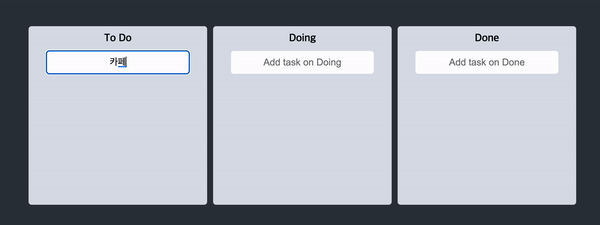
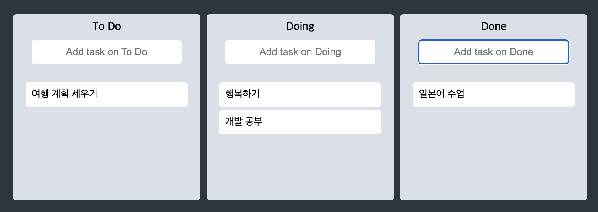
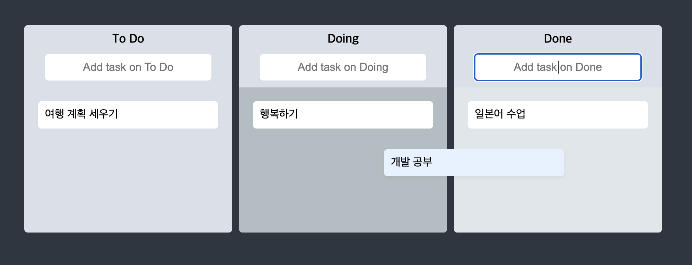

# 🔖 Trello

> React Practice Project

<br />

### npm install🧚‍♂️

```bash
npm install
npm start
```

👉 http://localhost:3000/ 접속됩니니다.

<br />

### Using🥷

- Styled Components
- TypeScript(4v)
- Recoil
- react-hook-form
- react-beautiful-dnd
  - `react-beautiful-dnd` 는 현재 react18 버전과 호환이 잘 되지않아 대체 라이브러리 권장
  - react-dnd https://react-dnd.github.io/react-dnd/about
  - 만약 react-beautiful-dnd 를 사용하고자 한다면 React.StrictMode 를 제거하면 동작 구현은 가능하다

<br />






